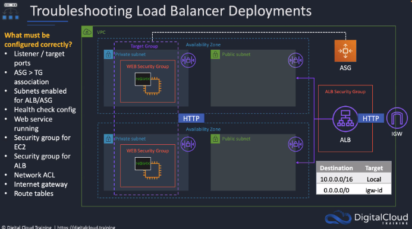

## Working through the problem
1. Listener/target ports:  Check the ALB target group and the ALB listener - they seem to be OK, both listening on port 80 for HTTP.
2. Added ```json
"TargetGroupARNs": [
      { "Ref": "ALBTargetGroup" }
    ],
    ``` To the Autoscaling group property.   There wasn't a `TargetGroupsARNs` specified in the Autoscaling group.
3. Removed the `depends on` properties for both the publicRoute "GatewayToInternet" and "ApplicationLoadBalancer" to IGW since they are both deprecated. - This is just undoing something I originally did.
